<div align="center">

<picture>
  <source media="(prefers-color-scheme: dark)" srcset="docs/assets/banner-dark.svg">
  <source media="(prefers-color-scheme: light)" srcset="docs/assets/banner-light.svg">
  
</picture>

<br>

**Audiobook library automation — staging, metadata, uploads, and collection management**

<p>
  <a href="https://www.python.org/downloads/"></a>
  <a href="LICENSE"></a>
  <a href="https://github.com/astral-sh/ruff"></a>
  <a href="https://coderabbit.ai"></a>
</p>

<p>
  <strong>Automates the pipeline from Libation audiobook downloads to MAM-ready torrents seeding in qBittorrent</strong>
</p>

<p>
  <a href="#-features">Features</a> •
  <a href="#-pipeline">Pipeline</a> •
  <a href="#-installation">Installation</a> •
  <a href="#-usage">Usage</a> •
  <a href="#-audiobookshelf-integration">Audiobookshelf</a> •
  <a href="#-development">Development</a>
</p>

</div>

---

## Features

<table>
<tr>
<td width="200"><strong>Libation Integration</strong></td>
<td>Trigger scans via <code>libationcli</code> in Docker with automatic book discovery</td>
</tr>
<tr>
<td><strong>Smart Staging</strong></td>
<td>Hardlink files to upload workspace with MAM-compliant naming (≤225 chars, automatic truncation with hash suffix)</td>
</tr>
<tr>
<td><strong>Japanese Transliteration</strong></td>
<td>Auto-converts Japanese author names using pykakasi with intelligent romanization</td>
</tr>
<tr>
<td><strong>Metadata Enrichment</strong></td>
<td>Fetch from <a href="https://api.audnex.us">Audnex API</a> + MediaInfo with series/volume detection</td>
</tr>
<tr>
<td><strong>Torrent Creation</strong></td>
<td>Uses mkbrr in Docker with configurable presets and piece sizes</td>
</tr>
<tr>
<td><strong>qBittorrent Upload</strong></td>
<td>Auto-add torrents with category/tags, ready for cross-seeding</td>
</tr>
<tr>
<td><strong>Production-Grade Retry</strong></td>
<td>Powered by <a href="https://github.com/jd/tenacity">tenacity</a> with exponential backoff and jitter</td>
</tr>
<tr>
<td><strong>Robust State Tracking</strong></td>
<td>Atomic writes, automatic backups, stale detection, and checkpoint recovery</td>
</tr>
<tr>
<td><strong>Audiobookshelf Import</strong></td>
<td>Direct library import with duplicate detection and quality-based trumping</td>
</tr>
<tr>
<td><strong>Type-Safe Architecture</strong></td>
<td>Strict typing with Pydantic v2 models and mypy verification</td>
</tr>
</table>

---

## Pipeline

```mermaid
graph LR
    A[📖 Libation Scan] --> B[🔍 Discover New]
    B --> C[📦 Stage/Hardlink]
    C --> D[📋 Metadata]
    D --> E[🧲 mkbrr]
    E --> F[⬆️ qBittorrent]
    F --> G[📚 Audiobookshelf]
```



<details>
<summary><strong>Pipeline Details</strong></summary>

| Stage | Description | Command |
|-------|-------------|---------|
| **Scan** | Check Audible for new purchases | `shelfr libation scan` |
| **Discover** | Find new audiobooks not yet processed | `shelfr libation list` |
| **Stage** | Hardlink files with MAM-compliant naming | `shelfr tools prepare` |
| **Metadata** | Generate MAM JSON (standalone) | `shelfr tools mamff <path>` |
| **Full Pipeline** | Run all steps end-to-end | `shelfr run` |
| **Import** | Import to Audiobookshelf (optional) | `shelfr abs import` |

</details>

---

## Installation

> [!NOTE]
> Repo name is `shelfr`; the app name/CLI is `shelfr`.

```bash
# Clone the repo
git clone https://github.com/H2OKing89/shelfr.git shelfr
cd shelfr

# Create virtual environment
python -m venv .venv

# Linux/macOS (bash/zsh)
source .venv/bin/activate

# Windows PowerShell
# .\.venv\Scripts\Activate.ps1

# Install in development mode
pip install -e ".[dev]"

# Copy config templates
mkdir -p config
cp config.yaml.example config/config.yaml
cp .env.example config/.env

# Edit with your settings
$EDITOR config/.env config/config.yaml
```

### Requirements

<table>
<tr>
<th>Requirement</th>
<th>Version</th>
<th>Notes</th>
</tr>
<tr>
<td><strong>Python</strong></td>
<td><code>3.11+</code></td>
<td>Required</td>
</tr>
<tr>
<td><strong>Docker</strong></td>
<td>Latest</td>
<td>For Libation and mkbrr containers</td>
</tr>
<tr>
<td><strong>qBittorrent</strong></td>
<td><code>4.x+</code></td>
<td>With Web UI enabled</td>
</tr>
<tr>
<td><strong>mediainfo</strong></td>
<td>Latest</td>
<td>CLI tool for audio metadata <sup>1</sup></td>
</tr>
</table>

<sup>1</sup> Runs on host, not inside Docker.

---

## Configuration

shelfr uses layered configuration with automatic validation.

> [!TIP]
> **Precedence**: `config.yaml` > `.env` > defaults
>
> Put secrets in `.env`, everything else in `config.yaml`.

<details>
<summary><strong>config/.env</strong> — Secrets only <em>(never commit)</em></summary>

```bash
# qBittorrent credentials (REQUIRED)
QB_HOST=http://192.168.1.100:8080
QB_USERNAME=admin
QB_PASSWORD=secret

# Audiobookshelf (only needed for abs import command)
AUDIOBOOKSHELF_HOST=https://abs.example.com
AUDIOBOOKSHELF_API_KEY=your-api-token-here

# Optional runtime settings
Shelfr_ENV=production
LOG_LEVEL=INFO
```

> [!NOTE]
> Docker/Libation settings (`LIBATION_CONTAINER`, `DOCKER_BIN`, `TARGET_UID`, `TARGET_GID`)
> belong in `config.yaml`'s `environment:` section, not here.

</details>

<details>
<summary><strong>config/config.yaml</strong> — Paths and settings</summary>

```yaml
# Docker/Libation settings (preferred location over .env)
environment:
  libation_container: "Libation"
  docker_bin: "/usr/bin/docker"
  target_uid: 99
  target_gid: 100

paths:
  library_root: "/mnt/user/data/audio/LibationLibrary"
  seed_root: "/mnt/user/data/seedvault/audiobooks"
  torrent_output: "/mnt/user/data/downloads/torrents/torrentfiles"
  # Optional: override the default XDG locations (platformdirs)
  # state_file: "./data/processed.json"
  # log_file: "./logs/shelfr.log"

mam:
  max_filename_length: 225
  allowed_extensions: [".m4b", ".jpg", ".jpeg", ".png", ".pdf", ".cue"]

filters:
  # Note: remove_phrases and author_map live in config/naming.json
  remove_book_numbers: true
  transliterate_japanese: true

naming:
  # Optional: "H2OKing" -> appends "[H2OKing]" to folder names
  ripper_tag: "H2OKing"

mkbrr:
  image: "ghcr.io/autobrr/mkbrr:latest"
  preset: "mam"
  host_data_root: "/mnt/user/data"
  container_data_root: "/data"

qbittorrent:
  category: "mam-audiobooks"
  tags: ["shelfr"]
  auto_start: true
  auto_tmm: false
  save_path: ""

audnex:
  base_url: "https://api.audnex.us"
  timeout_seconds: 30
  regions: ["us"]
```

**Naming rules** — `config/naming.json`

Naming rules control title/subtitle normalization and filtering used by the naming pipeline (e.g., phrases to remove, author mappings). See `config/naming.json` for the full example.

- `format_indicators`: phrases to remove from titles/subtitles (replaces old `remove_phrases`)
- `author_map`: explicit foreign name → romanized name mappings
- `genre_tags`: genre suffixes to strip from titles/subtitles
- `series_suffixes`: regex patterns to trim from series names
- `subtitle_patterns`: remove/keep subtitle patterns and related options
- `subtitle_redundancy_rules`: rules to drop redundant subtitles
- `preserve_exact`: exact titles that bypass all normalization

</details>

<details>
<summary><strong>config/categories.json</strong> — MAM genre mappings</summary>

Maps audiobook genres to MAM category IDs:

```json
{
  "fantasy": 39,
  "science fiction": 40,
  "mystery": 41
}
```

</details>

<details>
<summary><strong>Environment variables</strong> — XDG path overrides</summary>

shelfr uses XDG-compliant paths by default (via [platformdirs](https://github.com/platformdirs/platformdirs)):

```bash
# Override default data directory (for state files)
# Default: ~/.local/share/shelfr (Linux), ~/Library/Application Support/shelfr (macOS)
export SHELFR_DATA_DIR="/mnt/cache/appdata/shelfr/data"

# Override default cache directory
# Default: ~/.cache/shelfr (Linux), ~/Library/Caches/shelfr (macOS)
export SHELFR_CACHE_DIR="/mnt/cache/appdata/shelfr/cache"

# Override default log directory
# Default: ~/.local/state/shelfr (Linux), ~/Library/Logs/shelfr (macOS)
export SHELFR_LOG_DIR="/mnt/cache/appdata/shelfr/logs"
```

> [!NOTE]
> Explicitly configured paths in `config.yaml` always take precedence over environment variables.

</details>

---

## Usage

### Full Pipeline

```bash
shelfr run                   # Run everything
shelfr run --skip-scan       # Skip Libation scan
shelfr run --skip-metadata   # Skip metadata fetching
shelfr --dry-run run         # Preview without changes
```

### Step by Step

```bash
# Libation commands
shelfr libation scan          # Check for new Audible purchases
shelfr libation scan --liberate   # Scan and download new books
shelfr libation list          # List audiobooks in library
shelfr libation list --pending    # List pending downloads

# Staging and tools
shelfr tools prepare          # Stage files (hardlink + rename)
shelfr tools mamff /path/to/release   # Generate MAM JSON

# Full pipeline runs everything: scan → prepare → metadata → torrent → upload
shelfr run
```

### State Management

```bash
shelfr state list            # View all processed entries
shelfr state list --failed   # Show only failed entries
shelfr state prune           # Remove stale entries (missing files)
shelfr state retry <asin-or-id>  # Clear failed status for retry
shelfr state clear <asin-or-id>  # Remove entry completely
```

### Utilities

```bash
shelfr status            # Show processing statistics
shelfr config            # Debug: print loaded config
shelfr validate          # Validate configuration
shelfr check-duplicates  # Find potential duplicate releases
```

### Global Options

| Option | Description |
|--------|-------------|
| `--dry-run` | Preview without making changes |
| `-v, --verbose` | Enable DEBUG logging |
| `-c, --config PATH` | Custom config.yaml path |
| `-V, --version` | Show version |

> [!IMPORTANT]
> Global options like `--dry-run` must come **before** the subcommand:
>
> ```bash
> shelfr --dry-run abs import  # Correct
> shelfr abs import --dry-run  # Won't work
> ```

---

## Audiobookshelf Integration

shelfr supports importing audiobooks directly to Audiobookshelf libraries with duplicate detection and quality-based replacement (trumping).

### Basic Commands

```bash
shelfr abs init              # Initialize ABS connection
shelfr abs import            # Import staged books to ABS library
shelfr abs check-asin B0ASIN123  # Check if ASIN exists
shelfr abs trump-preview     # Preview trumping decisions
shelfr abs cleanup           # Clean orphaned files
shelfr abs restore           # List/restore archived books
```

### OPF Sidecar (metadata.opf)

shelfr can optionally generate a Calibre-compatible `metadata.opf` sidecar inside each imported book folder. This is useful for Audiobookshelf metadata ingestion (especially series detection via Calibre-style `meta` fields).

Enable via config:

```yaml
# config/config.yaml
audiobookshelf:
  import:
    generate_opf_sidecar: true
```

Or enable per-run with CLI flags:

```bash
shelfr abs import --opf         # enable
shelfr abs import --no-opf      # disable
shelfr --dry-run abs import --opf  # combine with global flags
```

### Trumping (Quality-Based Replacement)

When enabled, trumping automatically replaces lower-quality audiobooks with higher-quality versions:

```yaml
# config/config.yaml
audiobookshelf:
  enabled: true
  host: "http://localhost:13378"
  api_key: "your-api-key"
  import:
    trumping:
      enabled: true
      aggressiveness: balanced  # conservative | balanced | aggressive
      min_bitrate_increase_kbps: 64
      archive_root: "/mnt/user/data/audio/archive"
```

<details>
<summary><strong>Quality Hierarchy & Trumping Decisions</strong></summary>

**Format Ranking:** m4b > m4a > opus > mp3 > flac (for audiobooks)

> [!NOTE]
> FLAC is ranked lowest because speech doesn't benefit from lossless encoding, FLAC lacks chapter support, and file sizes are significantly larger.

**Trumping Decisions:**

| Decision | Action |
|----------|--------|
| **REPLACE_WITH_NEW** | New file is better → archive old, import new |
| **KEEP_EXISTING** | Existing is equal or better → skip import |
| **KEEP_BOTH** | Incomparable (different language) → defer to policy |
| **REJECT_NEW** | New is worse quality → skip entirely |

</details>

---

## Project Structure

shelfr uses a modular architecture with clean separation of concerns:

```text
shelfr/
├── src/shelfr/
│   ├── cli.py                  # CLI parser + main entry point
│   ├── config.py               # Configuration loading
│   ├── models.py               # Pydantic data models
│   ├── workflow.py             # Pipeline orchestration
│   │
│   ├── commands/               # CLI command handlers
│   │   ├── core.py             #    scan, discover, prepare, etc.
│   │   ├── utility.py          #    status, check, validate
│   │   ├── diagnostics.py      #    dry-run, check-duplicates
│   │   ├── state.py            #    state list/prune/retry/clear
│   │   └── abs.py              #    Audiobookshelf commands
│   │
│   ├── abs/                    # Audiobookshelf integration
│   │   ├── client.py           #    ABS API client
│   │   ├── importer.py         #    Import workflow
│   │   └── asin.py             #    ASIN extraction/resolution
│   │
│   ├── utils/
│   │   ├── naming/             # Modular naming system
│   │   │   ├── filters.py      #    Title/series filtering
│   │   │   ├── mam_paths.py    #    MAM path building
│   │   │   ├── normalization.py#    Book normalization
│   │   │   └── ...             #    8 focused modules
│   │   ├── cmd.py              # sh-library subprocess wrapper
│   │   ├── retry.py            # tenacity-powered retries
│   │   ├── state.py            #    State management (v2 schema)
│   │   └── paths.py            #    Host↔container path mapping
│   │
│   └── schemas/                # Pydantic schemas
│       ├── config.py           #    Configuration validation
│       └── state.py            #    State file schema v2
│
├── config/                     # Configuration (gitignored)
├── docs/                       # Technical documentation
│   ├── archive/                #    Completed implementation reports
│   └── audiobookshelf/         #    ABS integration guides
├── tests/                      # Comprehensive test suite
└── pyproject.toml              # Project configuration
```

<details>
<summary><strong>Recent Architecture Improvements</strong> (December 2025)</summary>

| Area | Change |
|------|--------|
| **CLI Split** | `cli.py` reduced from 4,100 → 820 lines via `commands/` subpackage |
| **Naming Refactor** | `naming.py` split into 9 focused modules for maintainability |
| **State Hardening** | Schema v2 with atomic writes, checkpoints, and backup recovery |
| **Production Deps** | Replaced custom code with `tenacity`, `platformdirs`, and `sh` library |

See [docs/README.md](docs/README.md) for the full documentation layout.

</details>

---

## Development

```bash
# Install dev dependencies
pip install -e ".[dev]"

# Run tests
pytest

# Run tests with coverage
pytest --cov=src/shelfr --cov-branch --cov-report=term

# Lint
ruff check src/

# Format
ruff format src/

# Type check
mypy src/

# Run all checks (pre-commit)
pre-commit run --all-files
```

### Pre-commit Hooks

shelfr uses pre-commit for automated code quality:

```yaml
# .pre-commit-config.yaml (excerpt)

repos:
  - repo: https://github.com/astral-sh/ruff-pre-commit
    rev: v0.8.0
    hooks:
      - id: ruff
      - id: ruff-format

  - repo: local
    hooks:
      - id: mypy
        name: mypy type checking
        entry: mypy
        language: system
        types: [python]
      - id: pytest
        name: pytest unit tests
        entry: pytest
        language: system
        types: [python]

```

---

## Acknowledgments

shelfr is built on top of excellent open-source projects and services:

<table>
<tr>
<td align="center" width="140">
<a href="https://github.com/laxamentumtech/audnexus">

</a>
<br><sub>Audiobook metadata</sub>
</td>
<td align="center" width="140">
<a href="https://github.com/advplyr/audiobookshelf">

</a>
<br><sub>Self-hosted streaming</sub>
</td>
<td align="center" width="140">
<a href="https://github.com/autobrr/mkbrr">

</a>
<br><sub>Torrent creation</sub>
</td>
<td align="center" width="140">
<a href="https://github.com/qbittorrent/qBittorrent">

</a>
<br><sub>BitTorrent client</sub>
</td>
</tr>
<tr>
<td align="center">
<a href="https://github.com/rmcrackan/Libation">

</a>
<br><sub>Audible manager</sub>
</td>
<td align="center">
<a href="https://mediaarea.net/en/MediaInfo">

</a>
<br><sub>Media analysis</sub>
</td>
<td align="center">
<a href="https://github.com/pydantic/pydantic">

</a>
<br><sub>Data validation</sub>
</td>
<td align="center">
<a href="https://github.com/Textualize/rich">

</a>
<br><sub>Terminal formatting</sub>
</td>
</tr>
</table>

---

## License

[MIT](LICENSE) © 2024-2025

---

<div align="center">
  <sub>Built with ❤️ for audiobook enthusiasts</sub>
</div>
