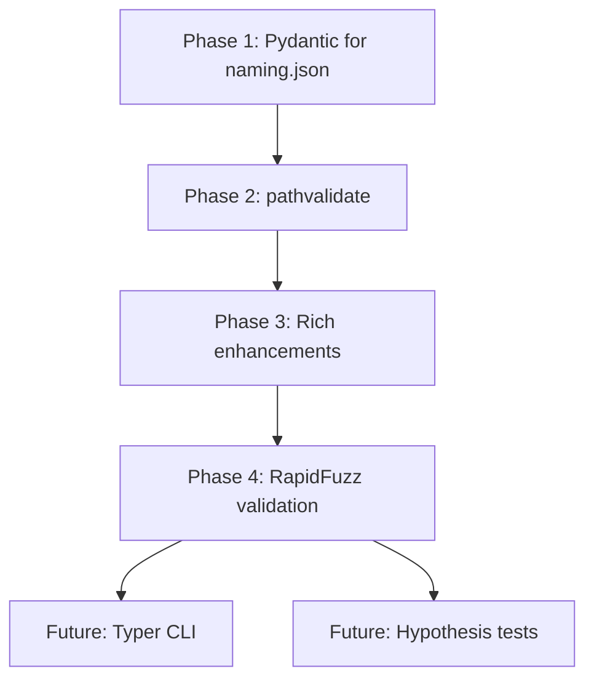

# MAMFast Improvements Plan

> Actionable roadmap for hardening the naming pipeline and improving DX.
> Derived from analysis of current implementation + community recommendations.

---

## Table of Contents

1. [Priority Matrix](#priority-matrix)
2. [Phase 1: Lock In Rules Engine](#phase-1-lock-in-rules-engine-pydantic)
3. [Phase 2: Bullet-Proof Filenames](#phase-2-bullet-proof-filenames-pathvalidate)
4. [Phase 3: Visibility & Debugging](#phase-3-visibility--debugging-rich-enhancements)
5. [Phase 4: Smart Validation](#phase-4-smart-validation-rapidfuzz)
6. [Future Considerations](#future-considerations)
7. [Implementation Order](#implementation-order)

---

## Priority Matrix

| Priority | Library | Purpose | Status |
|----------|---------|---------|--------|
| **A1** | `pydantic` | Validate `naming.json` schema | 🔲 Not started |
| **A2** | `pathvalidate` | Cross-platform filename safety | 🔲 Not started |
| **A3** | `rich` (enhance) | Debug/dry-run output | ✅ Installed, enhance usage |
| **A4** | `rapidfuzz` | Suspicious change detection | 🔲 Not started |
| **B1** | `typer` | CLI improvements | 🔲 Nice to have |
| **B2** | `tenacity` | Advanced retry logic | 🔲 Nice to have |
| **B3** | `orjson` | Performance for large JSON | 🔲 Nice to have |
| **B4** | `hypothesis` | Property-based testing | 🔲 Nice to have |

---

## Phase 1: Lock In Rules Engine (Pydantic)

### Problem

Current `NamingConfig` is a dataclass with no runtime validation. A typo in `naming.json` like:

```json
{"action": "drp_subtitle"}  // should be "drop_subtitle"
```

...silently fails at runtime instead of at startup.

### Solution

Add Pydantic models **just** for `naming.json` validation. Keep existing dataclass-based config for everything else.

### Implementation

#### 1.1 Create Pydantic models for naming.json

```python
# src/mamfast/schemas/naming.py
from __future__ import annotations

from typing import Literal
from pydantic import BaseModel, Field, field_validator


class SubtitleRedundancyRule(BaseModel):
    """A single subtitle redundancy rule."""

    id: str = Field(..., description="Unique rule identifier")
    description: str = Field(..., description="Human-readable description")
    pattern_template: str = Field(
        ..., description="Regex template with {{series}}/{{title}} placeholders"
    )
    action: Literal["drop_subtitle", "strip_match"] = Field(
        ..., description="What to do when pattern matches"
    )


class SubtitleRedundancyConfig(BaseModel):
    """Subtitle redundancy checking configuration."""

    enabled: bool = True
    rules: list[SubtitleRedundancyRule] = Field(default_factory=list)


class PhraseCategory(BaseModel):
    """Category of phrases to filter."""

    match_mode: Literal["phrase", "regex"] = "phrase"
    case_sensitive: bool = False
    phrases: list[str] = Field(default_factory=list)


class NamingSchema(BaseModel):
    """
    Pydantic schema for naming.json validation.

    This validates the JSON structure at load time.
    The validated data is then converted to NamingConfig dataclass.
    """

    version: str = Field(alias="_version", pattern=r"^\d+\.\d+\.\d+$")

    # Phrase categories
    format_indicators: PhraseCategory = Field(default_factory=PhraseCategory)
    genre_tags: PhraseCategory = Field(default_factory=PhraseCategory)
    publisher_tags: PhraseCategory = Field(default_factory=PhraseCategory)

    # Series cleaning
    series_suffixes: list[str] = Field(default_factory=list)

    # Subtitle handling
    subtitle_remove_patterns: list[str] = Field(default_factory=list)
    subtitle_keep_patterns: list[str] = Field(default_factory=list)
    remove_subtitle_if_matches_series: bool = True
    subtitle_redundancy_rules: SubtitleRedundancyConfig = Field(
        default_factory=SubtitleRedundancyConfig
    )

    # Preservation
    preserve_exact: list[str] = Field(default_factory=list)
    preserve_volume_in_json: bool = True

    # Author handling
    author_map: dict[str, str] = Field(default_factory=dict)
    author_roles: list[str] = Field(default_factory=list)
    credit_roles: list[str] = Field(default_factory=list)

    # Normalization
    normalize_title_subtitle: bool = True
    log_normalization_swaps: bool = True

    # Ripper tag
    ripper_tag: str | None = None

    @field_validator("series_suffixes", "subtitle_remove_patterns", "subtitle_keep_patterns")
    @classmethod
    def validate_regex_patterns(cls, v: list[str]) -> list[str]:
        """Validate that regex patterns compile."""
        import re
        for pattern in v:
            try:
                re.compile(pattern)
            except re.error as e:
                raise ValueError(f"Invalid regex pattern '{pattern}': {e}")
        return v

    model_config = {"extra": "forbid"}  # Fail on unknown keys
```

#### 1.2 Add validation to config loading

```python
# In src/mamfast/config.py

def _load_naming_config(config_dir: Path) -> NamingConfig:
    """Load and validate naming.json."""
    naming_path = config_dir / "naming.json"
    if not naming_path.exists():
        logger.warning(f"naming.json not found at {naming_path}, using defaults")
        return NamingConfig()

    try:
        data = json.loads(naming_path.read_text("utf-8"))

        # Validate with Pydantic
        from mamfast.schemas.naming import NamingSchema
        schema = NamingSchema.model_validate(data)

        # Convert to dataclass (existing code works with dataclass)
        return _schema_to_naming_config(schema)

    except ValidationError as e:
        raise ConfigurationError(f"Invalid naming.json: {e}")
```

#### 1.3 Add CLI command for validation

```bash
mamfast validate-config
```

Output:
```
✅ config.yaml: valid
✅ naming.json: valid (v1.2.0, 47 rules)
✅ categories.json: valid (156 genre mappings)
```

### Dependencies

```toml
# pyproject.toml
dependencies = [
    ...
    "pydantic>=2.0",
]
```

### Tests

- [ ] `test_naming_schema_valid.py` - Valid naming.json loads
- [ ] `test_naming_schema_invalid_action.py` - Bad action value fails
- [ ] `test_naming_schema_invalid_regex.py` - Bad regex fails
- [ ] `test_naming_schema_extra_keys.py` - Unknown keys fail
- [ ] `test_naming_schema_version_format.py` - Version pattern validation

[↑ Back to top](#mamfast-improvements-plan)

---

## Phase 2: Bullet-Proof Filenames (pathvalidate)

### Problem

Current sanitization handles common cases but may miss edge cases:
- Reserved Windows names (CON, PRN, NUL, etc.)
- Unicode normalization issues
- Platform-specific quirks

### Solution

Wrap existing filename builders with `pathvalidate` as a safety net.

### Implementation

#### 2.1 Add pathvalidate wrapper

```python
# src/mamfast/utils/naming.py

from pathvalidate import sanitize_filename as pv_sanitize

def build_safe_filename(raw: str, max_length: int = 225) -> str:
    """
    Build a safe filename with truncation and cross-platform sanitization.

    Order matters:
    1. Apply our custom sanitization (MAM-specific rules)
    2. Truncate to max length
    3. Apply pathvalidate for OS-level safety
    """
    # Our rules first
    sanitized = sanitize_filename(raw)

    # Truncate
    truncated = truncate_filename(sanitized, max_length=max_length)

    # Final safety pass
    return pv_sanitize(truncated, platform="auto")


def build_safe_dirname(raw: str, max_length: int = 225) -> str:
    """Build a safe directory name."""
    sanitized = sanitize_filename(raw)
    truncated = truncate_filename(sanitized, max_length=max_length)
    return pv_sanitize(truncated, platform="auto")
```

#### 2.2 Use in folder/file builders

```python
def build_release_dirname(...) -> str:
    """Build release directory name."""
    # ... existing logic to build raw name ...
    raw_name = f"{series} vol_{vol_num} ..."
    return build_safe_dirname(raw_name)
```

### Dependencies

```toml
dependencies = [
    ...
    "pathvalidate>=3.0",
]
```

### Tests

- [ ] `test_reserved_windows_names.py` - CON, PRN, NUL handled
- [ ] `test_unicode_normalization.py` - Various Unicode edge cases
- [ ] `test_platform_specific.py` - Windows vs Unix differences

[↑ Back to top](#mamfast-improvements-plan)

---

## Phase 3: Visibility & Debugging (Rich Enhancements)

### Current State

`rich` is already installed. Basic logging uses it via `RichHandler`.

### Enhancement Goals

1. **Rule trace tables** - See exactly what each rule did
2. **Dry-run mode** - Preview changes without writing
3. **Validation reports** - Pretty tables of issues

### Implementation

#### 3.1 Rule transformation logger

```python
# src/mamfast/utils/console.py

from rich.console import Console
from rich.table import Table

console = Console()


def log_title_transform(
    field: str,
    before: str,
    after: str,
    rule_id: str | None = None,
    verbose: bool = False,
) -> None:
    """Log a title transformation with optional rule trace."""
    if not verbose or before == after:
        return

    table = Table(show_header=True, header_style="bold cyan", box=None)
    table.add_column("Field", style="dim", width=12)
    table.add_column("Before", style="red")
    table.add_column("After", style="green")
    table.add_row(field, before, after)
    console.print(table)

    if rule_id:
        console.print(f"  [dim]rule:[/dim] [yellow]{rule_id}[/yellow]")


def print_validation_report(results: list[dict]) -> None:
    """Print validation report as Rich table."""
    table = Table(title="Validation Results", show_header=True)
    table.add_column("ASIN", style="cyan")
    table.add_column("Title", style="white")
    table.add_column("Status", style="green")
    table.add_column("Issues", style="yellow")

    for r in results:
        status = "✅" if r["valid"] else "❌"
        issues = ", ".join(r.get("issues", [])) or "-"
        table.add_row(r["asin"], r["title"][:40], status, issues)

    console.print(table)
```

#### 3.2 Dry-run command

```bash
mamfast dry-run --limit 5 --verbose
```

Output:
```
╭─────────────────────────────────────────────────────────────╮
│ Dry Run: Processing 5 releases                              │
╰─────────────────────────────────────────────────────────────╯

┏━━━━━━━━━━━━━━┳━━━━━━━━━━━━━━━━━━━━━━━━━━━┳━━━━━━━━━━━━━━━━━━━━━━━━━━━┓
┃ Field        ┃ Before                    ┃ After                     ┃
┡━━━━━━━━━━━━━━╇━━━━━━━━━━━━━━━━━━━━━━━━━━━╇━━━━━━━━━━━━━━━━━━━━━━━━━━━┩
│ title        │ Overlord (Light Novel)    │ Overlord                  │
└──────────────┴───────────────────────────┴───────────────────────────┘
  rule: format_indicators

┏━━━━━━━━━━━━━━┳━━━━━━━━━━━━━━━━━━━━━━━━━━━┳━━━━━━━━━━━━━━━━━━━━━━━━━━━┓
┃ Field        ┃ Before                    ┃ After                     ┃
┡━━━━━━━━━━━━━━╇━━━━━━━━━━━━━━━━━━━━━━━━━━━╇━━━━━━━━━━━━━━━━━━━━━━━━━━━┩
│ subtitle     │ Overlord 14               │ (dropped)                 │
└──────────────┴───────────────────────────┴───────────────────────────┘
  rule: subtitle_redundancy:series_vol_pattern
```

### No New Dependencies

Already have `rich>=13.0`.

[↑ Back to top](#mamfast-improvements-plan)

---

## Phase 4: Smart Validation (RapidFuzz)

### Problem

Current validation uses length-based heuristics:
```python
if abs(len(out) - len(in)) / len(in) > 0.5:
    flag_suspicious()
```

This misses semantic changes where length is similar but meaning differs.

### Solution

Use `rapidfuzz` for fuzzy string matching to detect "suspicious" changes.

### Implementation

#### 4.1 Add fuzzy validation

```python
# src/mamfast/validation.py

from rapidfuzz import fuzz


def is_suspicious_change(before: str, after: str, threshold: int = 50) -> bool:
    """
    Check if a title change is suspiciously large.

    Uses fuzzy ratio which handles:
    - Character transpositions
    - Partial removals
    - Japanese -> romaji changes

    Args:
        before: Original string
        after: Cleaned string
        threshold: Minimum similarity ratio (0-100)

    Returns:
        True if the change is suspicious (too different)
    """
    if not before.strip():
        return False
    if not after.strip():
        return True  # Completely empty output is always suspicious

    ratio = fuzz.ratio(before.lower(), after.lower())
    return ratio < threshold


def flag_suspicious_titles(
    releases: list[dict],
    threshold: int = 50,
) -> list[dict]:
    """
    Scan releases and flag those with suspicious title changes.

    Returns list of flagged releases with details.
    """
    flagged = []
    for release in releases:
        issues = []

        # Check title
        if is_suspicious_change(
            release.get("original_title", ""),
            release.get("cleaned_title", ""),
            threshold,
        ):
            issues.append("title_changed_significantly")

        # Check series
        if is_suspicious_change(
            release.get("original_series", ""),
            release.get("cleaned_series", ""),
            threshold,
        ):
            issues.append("series_changed_significantly")

        if issues:
            flagged.append({
                "asin": release.get("asin"),
                "title": release.get("original_title"),
                "issues": issues,
                "similarity": fuzz.ratio(
                    release.get("original_title", ""),
                    release.get("cleaned_title", ""),
                ),
            })

    return flagged
```

#### 4.2 Integration with validation command

```bash
mamfast validate --check-suspicious --threshold 60
```

Output:
```
⚠️  Found 3 suspicious title changes:

┏━━━━━━━━━━━━━━┳━━━━━━━━━━━━━━━━━━━━━━━━━━━┳━━━━━━━━━━━━━━┳━━━━━━━━━━━━━━━━━━━━━━━━━┓
┃ ASIN         ┃ Original Title            ┃ Similarity   ┃ Issues                  ┃
┡━━━━━━━━━━━━━━╇━━━━━━━━━━━━━━━━━━━━━━━━━━━╇━━━━━━━━━━━━━━╇━━━━━━━━━━━━━━━━━━━━━━━━━┩
│ B0ABC123     │ 転生したらスライムだった件  │ 42%          │ title_changed_signif... │
│ B0DEF456     │ Re:Zero vol_15 (LN)       │ 58%          │ title_changed_signif... │
│ B0GHI789     │ Mushoku Tensei: Jobless   │ 55%          │ series_changed_signi... │
└──────────────┴───────────────────────────┴──────────────┴─────────────────────────┘

Consider adding these to `preserve_exact` or adjusting filter rules.
```

### Dependencies

```toml
dependencies = [
    ...
    "rapidfuzz>=3.0",
]
```

### Tests

- [ ] `test_suspicious_detection.py` - Various change scenarios
- [ ] `test_threshold_tuning.py` - Different threshold values
- [ ] `test_japanese_transliteration.py` - Japanese to romaji changes

[↑ Back to top](#mamfast-improvements-plan)

---

## Future Considerations

These are good ideas that don't need immediate action:

### Typer CLI (B1)

When the CLI grows, migrate from argparse to typer:

```python
import typer
from rich import print

app = typer.Typer()

@app.command()
def validate(
    check_suspicious: bool = typer.Option(False, "--check-suspicious"),
    threshold: int = typer.Option(50, "--threshold"),
):
    """Validate configuration and optionally check for suspicious changes."""
    ...

@app.command()
def dry_run(
    limit: int = typer.Option(10, "--limit"),
    verbose: bool = typer.Option(False, "--verbose"),
):
    """Preview changes without writing."""
    ...
```

**When**: After core naming pipeline is stable.

### Tenacity Retries (B2)

If retry logic grows beyond current simple decorator:

```python
from tenacity import retry, stop_after_attempt, wait_exponential

@retry(
    stop=stop_after_attempt(3),
    wait=wait_exponential(multiplier=1, min=2, max=10),
    retry=retry_if_exception_type(httpx.HTTPStatusError),
)
async def fetch_audnex_metadata(asin: str) -> dict:
    ...
```

**When**: If Audnex rate limiting becomes a problem.

### orjson Performance (B3)

Drop-in replacement for large JSON handling:

```python
import orjson

def load_large_json(path: Path) -> dict:
    return orjson.loads(path.read_bytes())

def save_large_json(path: Path, data: dict) -> None:
    path.write_bytes(orjson.dumps(data, option=orjson.OPT_INDENT_2))
```

**When**: Processing thousands of releases at once.

### Hypothesis Testing (B4)

Property-based testing for invariants:

```python
from hypothesis import given, strategies as st

@given(st.text(min_size=1, max_size=500))
def test_cleanup_never_produces_double_spaces(title: str):
    result = filter_title(title)
    assert "  " not in result

@given(st.text(min_size=3))
def test_cleanup_never_empties_valid_title(title: str):
    # Assume title has at least some alphanumeric content
    assume(any(c.isalnum() for c in title))
    result = filter_title(title)
    assert len(result) > 0
```

**When**: In "hardening" mode after features are complete.

### Things to Avoid (for now)

| Tool | Why Wait |
|------|----------|
| `python-on-whales` | Current Docker exec approach works fine |
| `TinyDB` / `sqlite` | `processed.json` isn't fighting us yet |
| `loguru` | `logging` + Rich is sufficient |
| `hishel` | HTTP caching not needed yet |
| Full Pydantic Settings migration | Would require rewriting working config |

[↑ Back to top](#mamfast-improvements-plan)

---

## Implementation Order



### Suggested Timeline

| Phase | Effort | Priority | Blocks |
|-------|--------|----------|--------|
| **Phase 1** | 2-3 hours | HIGH | Nothing - can start now |
| **Phase 2** | 1 hour | HIGH | After Phase 1 |
| **Phase 3** | 2 hours | MEDIUM | Can parallel with Phase 2 |
| **Phase 4** | 2 hours | MEDIUM | After Phase 3 |

### Quick Wins First

1. **Add pydantic to deps** - 5 min
2. **Create naming schema** - 30 min
3. **Add pathvalidate** - 15 min
4. **Wire into existing code** - 1 hour

Total to "Phase 1 + 2 done": ~2 hours

[↑ Back to top](#mamfast-improvements-plan)

---

## Appendix: New Dependencies Summary

```toml
# pyproject.toml additions
dependencies = [
    # ... existing ...
    "pydantic>=2.0",        # Phase 1: Schema validation
    "pathvalidate>=3.0",    # Phase 2: Filename safety
    "rapidfuzz>=3.0",       # Phase 4: Fuzzy matching
]
```

All are:
- ✅ Well-maintained
- ✅ No heavy transitive dependencies
- ✅ MIT/BSD licensed
- ✅ Python 3.11+ compatible
