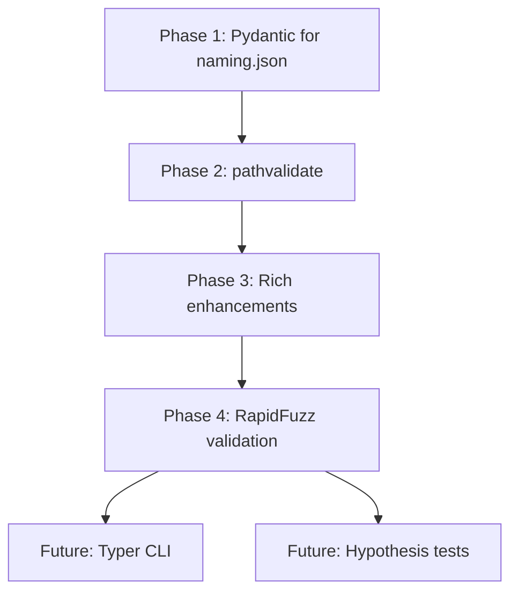

# MAMFast Improvements Plan

> Actionable roadmap for hardening MAMFast and improving DX across the entire codebase.
> Derived from analysis of current implementation + community recommendations.

---

## Table of Contents

1. [Priority Matrix](#priority-matrix)
2. [Phase 1: Schema Validation](#phase-1-schema-validation-pydantic)
3. [Phase 2: Bullet-Proof Filenames](#phase-2-bullet-proof-filenames-pathvalidate)
4. [Phase 3: Visibility & Debugging](#phase-3-visibility--debugging-rich-enhancements)
5. [Phase 4: Smart Validation](#phase-4-smart-validation-rapidfuzz)
6. [Future Considerations](#future-considerations)
7. [Implementation Order](#implementation-order)

---

## Priority Matrix

| Priority | Library | Purpose | Applies To | Status |
|----------|---------|---------|------------|--------|
| **A1** | `pydantic` | Schema validation | Config, naming.json, API responses, state files | ✅ COMPLETE |
| **A2** | `pathvalidate` | Cross-platform filename safety | Naming, hardlinker, torrent output | ✅ COMPLETE |
| **A3** | `rich` (enhance) | Debug/dry-run output | CLI, workflow, validation | ✅ COMPLETE |
| **A4** | `rapidfuzz` | Fuzzy matching & dedup | Naming validation, duplicate detection | ✅ COMPLETE |
| **B1** | `typer` | CLI improvements | All CLI commands | ⬜ Future |
| **B2** | `tenacity` | Advanced retry logic | Audnex, qBittorrent, Docker calls | ⬜ Future |
| **B3** | `orjson` | Performance for large JSON | State files, exports, metadata cache | ⬜ Future |
| **B4** | `hypothesis` | Property-based testing | All string processing, invariants | ⬜ Future |

---

## Phase 1: Schema Validation (Pydantic) ✅ COMPLETE

> **Status**: All high-value schemas complete: `naming.json`, `audnex.py`, `state.py`, `config.yaml`. Only `libation.py` remains (very low priority).

### Problem

Multiple data sources lack runtime validation:
- `naming.json` - typos silently fail ✅ SOLVED
- `config.yaml` - wrong types not caught until runtime ✅ SOLVED
- Audnex API responses - unexpected structure causes crashes ✅ SOLVED
- `processed.json` state - corruption goes undetected ✅ SOLVED
- Libation exports - malformed data causes pipeline failures (very low priority - simple format)

### Solution

Add Pydantic models for all external data boundaries. Keep existing dataclass-based config internally.

### Implementation

#### 1.1 Create schema modules ✅ COMPLETE

```
src/mamfast/schemas/
├── __init__.py         # ✅ Created - exports all schemas
├── naming.py           # ✅ Created - naming.json validation
├── audnex.py           # ✅ Created - Audnex API response validation
├── state.py            # ✅ Created - processed.json validation
├── config.py           # ✅ Created - config.yaml validation
└── libation.py         # ⬜ Optional - Libation export validation (simple format)
```

#### 1.2 Naming schema (naming.json) ✅ COMPLETE

```python
# src/mamfast/schemas/naming.py
from __future__ import annotations

from typing import Literal
from pydantic import BaseModel, Field, field_validator


class SubtitleRedundancyRule(BaseModel):
    """A single subtitle redundancy rule."""

    id: str = Field(..., description="Unique rule identifier")
    description: str = Field(..., description="Human-readable description")
    pattern_template: str = Field(
        ..., description="Regex template with {{series}}/{{title}} placeholders"
    )
    action: Literal["drop_subtitle", "strip_match"] = Field(
        ..., description="What to do when pattern matches"
    )


class SubtitleRedundancyConfig(BaseModel):
    """Subtitle redundancy checking configuration."""

    enabled: bool = True
    rules: list[SubtitleRedundancyRule] = Field(default_factory=list)


class PhraseCategory(BaseModel):
    """Category of phrases to filter."""

    match_mode: Literal["phrase", "regex"] = "phrase"
    case_sensitive: bool = False
    phrases: list[str] = Field(default_factory=list)


class NamingSchema(BaseModel):
    """
    Pydantic schema for naming.json validation.

    This validates the JSON structure at load time.
    The validated data is then converted to NamingConfig dataclass.
    """

    version: str = Field(alias="_version", pattern=r"^\d+\.\d+\.\d+$")

    # Phrase categories
    format_indicators: PhraseCategory = Field(default_factory=PhraseCategory)
    genre_tags: PhraseCategory = Field(default_factory=PhraseCategory)
    publisher_tags: PhraseCategory = Field(default_factory=PhraseCategory)

    # Series cleaning
    series_suffixes: list[str] = Field(default_factory=list)

    # Subtitle handling
    subtitle_remove_patterns: list[str] = Field(default_factory=list)
    subtitle_keep_patterns: list[str] = Field(default_factory=list)
    remove_subtitle_if_matches_series: bool = True
    subtitle_redundancy_rules: SubtitleRedundancyConfig = Field(
        default_factory=SubtitleRedundancyConfig
    )

    # Preservation
    preserve_exact: list[str] = Field(default_factory=list)
    preserve_volume_in_json: bool = True

    # Author handling
    author_map: dict[str, str] = Field(default_factory=dict)
    author_roles: list[str] = Field(default_factory=list)
    credit_roles: list[str] = Field(default_factory=list)

    # Normalization
    normalize_title_subtitle: bool = True
    log_normalization_swaps: bool = True

    # Ripper tag
    ripper_tag: str | None = None

    @field_validator("series_suffixes", "subtitle_remove_patterns", "subtitle_keep_patterns")
    @classmethod
    def validate_regex_patterns(cls, v: list[str]) -> list[str]:
        """Validate that regex patterns compile."""
        import re
        for pattern in v:
            try:
                re.compile(pattern)
            except re.error as e:
                raise ValueError(f"Invalid regex pattern '{pattern}': {e}")
        return v

    model_config = {"extra": "forbid"}  # Fail on unknown keys
```

#### 1.3 Audnex API response schema

```python
# src/mamfast/schemas/audnex.py
from pydantic import BaseModel, Field, field_validator
from typing import Literal


class AudnexAuthor(BaseModel):
    """Author from Audnex API."""
    asin: str
    name: str


class AudnexSeries(BaseModel):
    """Series info from Audnex API."""
    asin: str | None = None
    name: str
    position: str | None = None


class AudnexChapter(BaseModel):
    """Chapter from Audnex API."""
    lengthMs: int
    startOffsetMs: int
    startOffsetSec: int
    title: str


class AudnexBook(BaseModel):
    """
    Validated Audnex book response.

    Catches API changes/malformed responses at the boundary.
    """
    asin: str
    title: str
    subtitle: str | None = None
    authors: list[AudnexAuthor] = Field(default_factory=list)
    narrators: list[AudnexAuthor] = Field(default_factory=list)
    seriesPrimary: AudnexSeries | None = None
    seriesSecondary: AudnexSeries | None = None
    genres: list[dict] = Field(default_factory=list)
    releaseDate: str | None = None
    publisherName: str | None = None
    summary: str | None = None
    image: str | None = None
    chapters: list[AudnexChapter] = Field(default_factory=list)
    lengthMin: int | None = None
    language: str | None = None
    region: str | None = None

    model_config = {"extra": "ignore"}  # API may add new fields
```

#### 1.4 State file schema (processed.json)

```python
# src/mamfast/schemas/state.py
from pydantic import BaseModel, Field
from datetime import datetime


class ProcessedRelease(BaseModel):
    """A single processed release entry."""
    asin: str
    title: str
    series: str | None = None
    processed_at: datetime
    status: str  # "complete", "failed", etc.
    torrent_path: str | None = None
    folder_name: str | None = None


class ProcessedState(BaseModel):
    """
    Schema for processed.json state file.

    Validates state integrity on load, catches corruption.
    """
    version: str = "1.0.0"
    releases: dict[str, ProcessedRelease] = Field(default_factory=dict)

    @classmethod
    def load(cls, path: Path) -> "ProcessedState":
        """Load and validate state file."""
        if not path.exists():
            return cls()
        data = json.loads(path.read_text())
        return cls.model_validate(data)

    def save(self, path: Path) -> None:
        """Save state with validation."""
        path.write_text(self.model_dump_json(indent=2))
```

#### 1.5 Config schema (config.yaml)

```python
# src/mamfast/schemas/config.py
from pydantic import BaseModel, Field, field_validator, DirectoryPath, FilePath
from pathlib import Path


class PathsSchema(BaseModel):
    """Paths configuration validation."""
    library_root: Path
    torrent_output: Path
    seed_root: Path
    state_file: Path = Path("data/processed.json")
    log_file: Path = Path("logs/mamfast.log")

    @field_validator("library_root", "seed_root")
    @classmethod
    def validate_directory_exists(cls, v: Path) -> Path:
        if not v.exists():
            raise ValueError(f"Directory does not exist: {v}")
        if not v.is_dir():
            raise ValueError(f"Not a directory: {v}")
        return v


class QBittorrentSchema(BaseModel):
    """qBittorrent configuration validation."""
    category: str = "audiobooks"
    tags: list[str] = Field(default_factory=list)
    auto_start: bool = True
    auto_tmm: bool = False
    save_path: str | None = None


class ConfigSchema(BaseModel):
    """
    Top-level config.yaml validation.

    Catches missing required fields, wrong types, invalid paths.
    """
    paths: PathsSchema
    mam: dict = Field(default_factory=dict)
    mkbrr: dict = Field(default_factory=dict)
    qbittorrent: QBittorrentSchema = Field(default_factory=QBittorrentSchema)
    audnex: dict = Field(default_factory=dict)
    filters: dict = Field(default_factory=dict)

    model_config = {"extra": "allow"}  # Allow unknown sections for extensibility
```

#### 1.6 Add validation to config loading ✅ COMPLETE

```python
# In src/mamfast/config.py

def _load_naming_config(config_dir: Path) -> NamingConfig:
    """Load and validate naming.json."""
    naming_path = config_dir / "naming.json"
    if not naming_path.exists():
        logger.warning(f"naming.json not found at {naming_path}, using defaults")
        return NamingConfig()

    try:
        data = json.loads(naming_path.read_text("utf-8"))

        # Validate with Pydantic
        from mamfast.schemas.naming import NamingSchema
        schema = NamingSchema.model_validate(data)

        # Convert to dataclass (existing code works with dataclass)
        return _schema_to_naming_config(schema)

    except ValidationError as e:
        raise ConfigurationError(f"Invalid naming.json: {e}")
```

#### 1.7 Add CLI command for validation ✅ COMPLETE

```bash
mamfast validate-config
```

Output:
```
✅ config.yaml: valid
✅ naming.json: valid (v1.2.0, 47 rules)
✅ categories.json: valid (156 genre mappings)
✅ processed.json: valid (127 releases)
```

### Where Pydantic Applies

| Component | Schema | Catches |
|-----------|--------|---------|
| `config.yaml` | `ConfigSchema` | Missing paths, wrong types |
| `naming.json` | `NamingSchema` | Invalid actions, bad regexes |
| `categories.json` | `CategoriesSchema` | Invalid category IDs |
| `processed.json` | `ProcessedState` | Corrupted state, missing fields |
| Audnex responses | `AudnexBook` | API changes, malformed data |
| Libation exports | `LibationExport` | Unexpected format changes |

### Dependencies

```toml
# pyproject.toml
dependencies = [
    ...
    "pydantic>=2.0",
]
```

### Tests

- [x] `test_schemas.py` - naming.json validation (18 tests) ✅
- [ ] `test_config_schema.py` - config.yaml validation
- [ ] `test_audnex_schema.py` - API response validation
- [ ] `test_state_schema.py` - processed.json validation
- [ ] `test_schema_migration.py` - Version upgrades

[↑ Back to top](#mamfast-improvements-plan)

---

## Phase 2: Bullet-Proof Filenames (pathvalidate) ✅ COMPLETE

> **Status**: pathvalidate integrated into `paths.py` and `naming.py`. Tests added.

### Problem

Current sanitization handles common cases but may miss edge cases:
- Reserved Windows names (CON, PRN, NUL, etc.)
- Unicode normalization issues
- Platform-specific quirks

These affect multiple components:
- **Naming**: Release folder names, file names
- **Hardlinker**: Destination paths for hardlinks
- **Torrent output**: .torrent file names
- **State files**: Paths stored in processed.json

### Solution

Wrap all path/filename generation with `pathvalidate` as a safety net.

### Implementation

#### 2.1 Create centralized path safety module ✅ COMPLETE

```python
# src/mamfast/utils/paths.py (extend existing)

from pathvalidate import sanitize_filename as pv_sanitize
from pathvalidate import sanitize_filepath as pv_sanitize_path


def safe_filename(raw: str, max_length: int = 225) -> str:
    """
    Build a safe filename with truncation and cross-platform sanitization.

    Order matters:
    1. Apply our custom sanitization (MAM-specific rules)
    2. Truncate to max length
    3. Apply pathvalidate for OS-level safety
    """
    from mamfast.utils.naming import sanitize_filename, truncate_filename

    sanitized = sanitize_filename(raw)
    truncated = truncate_filename(sanitized, max_length=max_length)
    return pv_sanitize(truncated, platform="auto")


def safe_dirname(raw: str, max_length: int = 225) -> str:
    """Build a safe directory name."""
    from mamfast.utils.naming import sanitize_filename, truncate_filename

    sanitized = sanitize_filename(raw)
    truncated = truncate_filename(sanitized, max_length=max_length)
    return pv_sanitize(truncated, platform="auto")


def safe_path(raw: str | Path) -> Path:
    """Sanitize a full path (handles each component)."""
    return Path(pv_sanitize_path(str(raw), platform="auto"))
```

#### 2.2 Apply across codebase

```python
# src/mamfast/utils/naming.py - build_release_dirname()
def build_release_dirname(...) -> str:
    """Build release directory name."""
    raw_name = f"{series} vol_{vol_num} ..."
    return safe_dirname(raw_name)

# src/mamfast/hardlinker.py - hardlink destination
def create_hardlink(src: Path, dest_dir: Path, filename: str) -> Path:
    safe_name = safe_filename(filename)
    dest = dest_dir / safe_name
    ...

# src/mamfast/mkbrr.py - torrent file naming
def create_torrent(release: AudiobookRelease) -> Path:
    torrent_name = safe_filename(f"{release.folder_name}.torrent")
    ...

# src/mamfast/utils/state.py - stored paths
def record_processed(release: AudiobookRelease) -> None:
    # Paths stored in state are already sanitized at creation
    state.releases[release.asin] = ProcessedRelease(
        folder_name=release.folder_name,  # Already safe
        ...
    )
```

### Where pathvalidate Applies

| Component | Function | Why |
|-----------|----------|-----|
| `naming.py` | `build_release_dirname()` | Release folder names |
| `naming.py` | `build_m4b_filename()` | Audio file names |
| `hardlinker.py` | `create_hardlinks()` | Destination paths |
| `mkbrr.py` | `create_torrent()` | Torrent file names |
| `metadata.py` | `write_mam_json()` | JSON file paths |

### Dependencies

```toml
dependencies = [
    ...
    "pathvalidate>=3.0",
]
```

### Tests

- [x] `test_pathvalidate.py` - Comprehensive tests (20 tests) ✅
  - Reserved Windows names (CON, PRN, NUL)
  - Unicode handling
  - Edge cases (empty, dots, spaces, null bytes)
  - Integration with naming.py functions

[↑ Back to top](#mamfast-improvements-plan)

---

## Phase 3: Visibility & Debugging (Rich Enhancements) ✅ COMPLETE

> **Status**: All Rich enhancements implemented in `console.py`. 31 new tests added.

### Current State

`rich` is already installed. Basic logging uses it via `RichHandler`.

### Enhancement Goals

1. **Rule trace tables** - See exactly what each rule did
2. **Dry-run mode** - Preview changes without writing
3. **Validation reports** - Pretty tables of issues
4. **Workflow progress** - Show pipeline stages
5. **Error formatting** - Better exception display

### Implementation

#### 3.1 Create console utilities module

```python
# src/mamfast/utils/console.py

from rich.console import Console
from rich.table import Table
from rich.progress import Progress, SpinnerColumn, TextColumn
from rich.panel import Panel

console = Console()


def log_title_transform(
    field: str,
    before: str,
    after: str,
    rule_id: str | None = None,
    verbose: bool = False,
) -> None:
    """Log a title transformation with optional rule trace."""
    if not verbose or before == after:
        return

    table = Table(show_header=True, header_style="bold cyan", box=None)
    table.add_column("Field", style="dim", width=12)
    table.add_column("Before", style="red")
    table.add_column("After", style="green")
    table.add_row(field, before, after)
    console.print(table)

    if rule_id:
        console.print(f"  [dim]rule:[/dim] [yellow]{rule_id}[/yellow]")


def print_validation_report(results: list[dict]) -> None:
    """Print validation report as Rich table."""
    table = Table(title="Validation Results", show_header=True)
    table.add_column("ASIN", style="cyan")
    table.add_column("Title", style="white")
    table.add_column("Status", style="green")
    table.add_column("Issues", style="yellow")

    for r in results:
        status = "✅" if r["valid"] else "❌"
        issues = ", ".join(r.get("issues", [])) or "-"
        table.add_row(r["asin"], r["title"][:40], status, issues)

    console.print(table)


def print_workflow_summary(releases: list, stats: dict) -> None:
    """Print workflow completion summary."""
    table = Table(title="Workflow Summary", show_header=True)
    table.add_column("Metric", style="cyan")
    table.add_column("Value", style="white")

    table.add_row("Total Discovered", str(stats.get("discovered", 0)))
    table.add_row("Staged", str(stats.get("staged", 0)))
    table.add_row("Metadata Fetched", str(stats.get("metadata", 0)))
    table.add_row("Torrents Created", str(stats.get("torrents", 0)))
    table.add_row("Uploaded to qBit", str(stats.get("uploaded", 0)))
    table.add_row("Skipped", str(stats.get("skipped", 0)))
    table.add_row("Errors", str(stats.get("errors", 0)))

    console.print(table)


def print_release_details(release) -> None:
    """Print detailed release info in a panel."""
    from mamfast.models import AudiobookRelease

    if not isinstance(release, AudiobookRelease):
        return

    content = f"""[cyan]ASIN:[/cyan] {release.asin}
[cyan]Title:[/cyan] {release.title}
[cyan]Series:[/cyan] {release.series or 'N/A'}
[cyan]Authors:[/cyan] {', '.join(a.get('name', '') for a in release.authors[:3])}
[cyan]Folder:[/cyan] {release.folder_name or 'Not set'}
[cyan]Status:[/cyan] {release.status.value}"""

    console.print(Panel(content, title=release.title[:50], expand=False))
```

#### 3.2 Workflow progress display

```python
# src/mamfast/workflow.py

from mamfast.utils.console import console

def run_workflow(releases: list[AudiobookRelease], dry_run: bool = False) -> None:
    """Run the full workflow with progress display."""
    from rich.progress import track

    with console.status("[bold green]Processing releases...") as status:
        for i, release in enumerate(releases):
            status.update(f"[bold green]Processing {i+1}/{len(releases)}: {release.title[:30]}...")

            # Stage
            stage_release(release)

            # Fetch metadata
            status.update(f"[bold blue]Fetching metadata for {release.title[:30]}...")
            fetch_metadata(release)

            # Create torrent
            if not dry_run:
                status.update(f"[bold yellow]Creating torrent for {release.title[:30]}...")
                create_torrent(release)

    console.print("[bold green]✅ Workflow complete!")
```

#### 3.3 Error display

```python
# src/mamfast/utils/console.py

def print_error(title: str, error: Exception, context: dict | None = None) -> None:
    """Print formatted error with context."""
    from rich.traceback import Traceback

    console.print(f"[bold red]❌ {title}[/bold red]")
    if context:
        for key, value in context.items():
            console.print(f"  [dim]{key}:[/dim] {value}")
    console.print(Traceback.from_exception(type(error), error, error.__traceback__))
```

#### 3.4 Preview Naming command

```bash
mamfast preview-naming --limit 5 --verbose
```

Output:
```
╭─────────────────────────────────────────────────────────────╮
│ Dry Run: Processing 5 releases                              │
╰─────────────────────────────────────────────────────────────╯

┏━━━━━━━━━━━━━━┳━━━━━━━━━━━━━━━━━━━━━━━━━━━┳━━━━━━━━━━━━━━━━━━━━━━━━━━━┓
┃ Field        ┃ Before                    ┃ After                     ┃
┡━━━━━━━━━━━━━━╇━━━━━━━━━━━━━━━━━━━━━━━━━━━╇━━━━━━━━━━━━━━━━━━━━━━━━━━━┩
│ title        │ Overlord (Light Novel)    │ Overlord                  │
└──────────────┴───────────────────────────┴───────────────────────────┘
  rule: format_indicators
```

### Where Rich Applies

| Component | Feature | Purpose |
|-----------|---------|---------|
| `cli.py` | Command output | Status, summaries, errors |
| `workflow.py` | Progress display | Stage tracking |
| `naming.py` | Rule traces | Debug title transformations |
| `validation.py` | Reports | Validation result tables |
| `metadata.py` | API responses | Debug Audnex data |
| All modules | Error handling | Formatted tracebacks |

### No New Dependencies

Already have `rich>=13.0`.

### Tests

- [x] `test_console.py` - Comprehensive tests (31 new tests for Phase 3) ✅
  - RuleTrace dataclass and logging
  - Validation report and summary tables
  - Workflow progress helpers
  - Exception and error formatting

[↑ Back to top](#mamfast-improvements-plan)

---

## Phase 4: Smart Validation (RapidFuzz) ✅ COMPLETE

> **Status**: Core fuzzy utilities, CLI commands for duplicate detection and suspicious change detection, and console output helpers all implemented. Tests: 55 fuzzy tests + 10 console tests = 65 new tests.

### Problem

Current validation uses length-based heuristics:
```python
if abs(len(out) - len(in)) / len(in) > 0.5:
    flag_suspicious()
```

This misses semantic changes where length is similar but meaning differs.

Beyond just naming validation, fuzzy matching is useful across the codebase:
- **Duplicate detection** - Find near-duplicate releases in library
- **Author matching** - Match "Reki Kawahara" to "川原 礫"
- **Series grouping** - Group "Re:Zero" and "Re: Zero" and "ReZero"
- **Title normalization** - Detect when Audnex title differs from Libation

### Solution

Use `rapidfuzz` for fuzzy string matching throughout the codebase.

### Implementation

#### 4.1 Core fuzzy utilities

```python
# src/mamfast/utils/fuzzy.py

from rapidfuzz import fuzz, process


def similarity_ratio(a: str, b: str) -> float:
    """Get similarity ratio between two strings (0-100)."""
    if not a or not b:
        return 0.0
    return fuzz.ratio(a.lower(), b.lower())


def is_suspicious_change(before: str, after: str, threshold: int = 50) -> bool:
    """
    Check if a title change is suspiciously large.

    Uses fuzzy ratio which handles:
    - Character transpositions
    - Partial removals
    - Japanese -> romaji changes
    """
    if not before.strip():
        return False
    if not after.strip():
        return True  # Completely empty output is always suspicious

    return similarity_ratio(before, after) < threshold


def find_best_match(query: str, choices: list[str], threshold: int = 80) -> str | None:
    """Find best matching string from choices."""
    if not choices:
        return None
    result = process.extractOne(query, choices, score_cutoff=threshold)
    return result[0] if result else None


def find_duplicates(items: list[str], threshold: int = 90) -> list[tuple[str, str, float]]:
    """Find near-duplicate strings in a list."""
    duplicates = []
    seen = set()

    for i, item1 in enumerate(items):
        if item1 in seen:
            continue
        for item2 in items[i + 1:]:
            ratio = similarity_ratio(item1, item2)
            if ratio >= threshold:
                duplicates.append((item1, item2, ratio))
                seen.add(item2)

    return duplicates
```

#### 4.2 Duplicate release detection

```python
# src/mamfast/discovery.py

from mamfast.utils.fuzzy import find_duplicates, similarity_ratio


def find_duplicate_releases(releases: list[AudiobookRelease]) -> list[tuple]:
    """Find potential duplicate releases in library."""
    titles = [r.title for r in releases]
    duplicates = find_duplicates(titles, threshold=85)

    results = []
    for title1, title2, ratio in duplicates:
        r1 = next(r for r in releases if r.title == title1)
        r2 = next(r for r in releases if r.title == title2)
        results.append({
            "release1": r1,
            "release2": r2,
            "title_similarity": ratio,
            "same_author": r1.authors == r2.authors,
            "same_series": similarity_ratio(r1.series or "", r2.series or "") > 90,
        })

    return results
```

#### 4.3 Author name matching

```python
# src/mamfast/utils/naming.py

from mamfast.utils.fuzzy import find_best_match


def match_author_name(
    author: str,
    known_authors: dict[str, str],
    threshold: int = 85,
) -> str:
    """
    Match author name to known mappings using fuzzy matching.

    Handles variations like:
    - "Reki Kawahara" -> "Reki Kawahara"
    - "川原 礫" -> "Reki Kawahara" (if in mapping)
    - "Kawahara, Reki" -> "Reki Kawahara"
    """
    # Exact match first
    if author in known_authors:
        return known_authors[author]

    # Fuzzy match against known names
    match = find_best_match(author, list(known_authors.keys()), threshold)
    if match:
        return known_authors[match]

    return author
```

#### 4.4 Series grouping

```python
# src/mamfast/metadata.py

from mamfast.utils.fuzzy import similarity_ratio


def normalize_series_name(series: str, known_series: list[str]) -> str:
    """
    Normalize series name to match existing series in library.

    Groups variations like:
    - "Re:Zero" / "Re: Zero" / "ReZero"
    - "Sword Art Online" / "SAO"
    """
    for known in known_series:
        if similarity_ratio(series, known) > 90:
            return known  # Use existing name for consistency
    return series
```

#### 4.5 Validation integration

```python
# src/mamfast/validation.py

from mamfast.utils.fuzzy import is_suspicious_change, find_duplicates


def flag_suspicious_titles(
    releases: list[dict],
    threshold: int = 50,
) -> list[dict]:
    """Scan releases and flag those with suspicious title changes."""
    flagged = []
    for release in releases:
        issues = []

        if is_suspicious_change(
            release.get("original_title", ""),
            release.get("cleaned_title", ""),
            threshold,
        ):
            issues.append("title_changed_significantly")

        if is_suspicious_change(
            release.get("original_series", ""),
            release.get("cleaned_series", ""),
            threshold,
        ):
            issues.append("series_changed_significantly")

        if issues:
            flagged.append({
                "asin": release.get("asin"),
                "title": release.get("original_title"),
                "issues": issues,
            })

    return flagged


def validate_library_duplicates(releases: list) -> list[dict]:
    """Check for potential duplicate releases."""
    titles = [(r.asin, r.title) for r in releases]
    duplicates = []

    for i, (asin1, title1) in enumerate(titles):
        for asin2, title2 in titles[i + 1:]:
            ratio = similarity_ratio(title1, title2)
            if ratio > 85:
                duplicates.append({
                    "asin1": asin1,
                    "asin2": asin2,
                    "title1": title1,
                    "title2": title2,
                    "similarity": ratio,
                })

    return duplicates
```

#### 4.6 CLI integration

```bash
# Check for suspicious title changes
mamfast validate --check-suspicious --threshold 60

# Find potential duplicates in library
mamfast check-duplicates --threshold 85
```

Output:
```
⚠️  Found 3 suspicious title changes:

┏━━━━━━━━━━━━━━┳━━━━━━━━━━━━━━━━━━━━━━━━━━━┳━━━━━━━━━━━━━━┓
┃ ASIN         ┃ Original Title            ┃ Similarity   ┃
┡━━━━━━━━━━━━━━╇━━━━━━━━━━━━━━━━━━━━━━━━━━━╇━━━━━━━━━━━━━━┩
│ B0ABC123     │ 転生したらスライムだった件  │ 42%          │
│ B0DEF456     │ Re:Zero vol_15 (LN)       │ 58%          │
└──────────────┴───────────────────────────┴──────────────┘

🔍 Potential duplicates found:

┏━━━━━━━━━━━━━━┳━━━━━━━━━━━━━━━━━━━━━━━━━━━┳━━━━━━━━━━━━━━┓
┃ Release 1    ┃ Release 2                 ┃ Similarity   ┃
┡━━━━━━━━━━━━━━╇━━━━━━━━━━━━━━━━━━━━━━━━━━━╇━━━━━━━━━━━━━━┩
│ Overlord 14  │ Overlord, Vol. 14         │ 92%          │
└──────────────┴───────────────────────────┴──────────────┘
```

### Where RapidFuzz Applies

| Component | Use Case | Purpose |
|-----------|----------|---------|
| `validation.py` | Title change detection | Flag over-aggressive cleaning |
| `discovery.py` | Duplicate detection | Find near-duplicate releases |
| `naming.py` | Author matching | Fuzzy author name lookup |
| `metadata.py` | Series normalization | Group series variations |
| `workflow.py` | Audnex vs Libation | Detect title mismatches |

### Dependencies

```toml
dependencies = [
    ...
    "rapidfuzz>=3.0",
]
```

### Tests

- [x] `test_fuzzy.py` - Core fuzzy functions (55 tests)
- [x] Suspicious change detection in `test_fuzzy.py`
- [x] Duplicate detection in `test_fuzzy.py`
- [x] Author name fuzzy match in `test_fuzzy.py`
- [x] Series name normalization in `test_fuzzy.py`
- [x] Console output helpers in `test_console.py` (10 tests)
- [x] Workflow integration tests in `test_validation.py` and `test_discovery.py` (7 tests)

### Implementation Status

#### Completed ✅

1. **Core Utilities** (`src/mamfast/utils/fuzzy.py`):
   - `similarity_ratio()` - Basic string similarity
   - `partial_ratio()` - Partial string matching
   - `weighted_ratio()` - Combined scoring
   - `is_suspicious_change()` - Detect over-aggressive cleaning
   - `analyze_change()` - Detailed change analysis with ChangeAnalysis dataclass
   - `find_best_match()` - Find best match from choices
   - `find_matches()` - Find all matches above threshold
   - `find_duplicates()` - Find duplicate pairs with DuplicatePair dataclass
   - `find_duplicates_in_groups()` - Efficient duplicate detection for grouped items
   - `match_name()` - Fuzzy name matching with mappings
   - `normalize_author_name()` - Author name normalization
   - `normalize_series_name()` - Series name normalization
   - `group_similar_series()` - Group similar series names

2. **CLI Commands**:
   - `mamfast check-duplicates` - Find potential duplicate releases
   - `mamfast check-suspicious` - Detect over-aggressive title cleaning

3. **Console Helpers** (`src/mamfast/console.py`):
   - `print_duplicate_pairs()` - Display duplicate pairs in Rich table
   - `print_suspicious_changes()` - Display suspicious changes with tips
   - `print_change_analysis()` - Detailed single change analysis

4. **Workflow Integration**:
   - `validation.py` - `_check_title_cleaning()` warns when naming rules are too aggressive
   - `discovery.py` - `find_duplicate_releases()` detects near-duplicate titles with author/series signals
   - `naming.py` - Fuzzy fallback for `author_map` lookups in `transliterate_text()`
   - `workflow.py` - Warns when Audnex API title differs significantly from Libation folder name

**Total Tests**: 877 (55 fuzzy + 10 console + 7 integration = 72 new tests)

[↑ Back to top](#mamfast-improvements-plan)

---

## Future Considerations

These are good ideas that don't need immediate action:

### Typer CLI (B1)

When the CLI grows, migrate from argparse to typer:

```python
import typer
from rich import print

app = typer.Typer()

@app.command()
def validate(
    check_suspicious: bool = typer.Option(False, "--check-suspicious"),
    threshold: int = typer.Option(50, "--threshold"),
):
    """Validate configuration and optionally check for suspicious changes."""
    ...

@app.command()
def dry_run(
    limit: int = typer.Option(10, "--limit"),
    verbose: bool = typer.Option(False, "--verbose"),
):
    """Preview changes without writing."""
    ...
```

**When**: After core naming pipeline is stable.

### Tenacity Retries (B2)

If retry logic grows beyond current simple decorator:

```python
from tenacity import retry, stop_after_attempt, wait_exponential

@retry(
    stop=stop_after_attempt(3),
    wait=wait_exponential(multiplier=1, min=2, max=10),
    retry=retry_if_exception_type(httpx.HTTPStatusError),
)
async def fetch_audnex_metadata(asin: str) -> dict:
    ...
```

**When**: If Audnex rate limiting becomes a problem.

### orjson Performance (B3)

Drop-in replacement for large JSON handling:

```python
import orjson

def load_large_json(path: Path) -> dict:
    return orjson.loads(path.read_bytes())

def save_large_json(path: Path, data: dict) -> None:
    path.write_bytes(orjson.dumps(data, option=orjson.OPT_INDENT_2))
```

**When**: Processing thousands of releases at once.

### Hypothesis Testing (B4)

Property-based testing for invariants:

```python
from hypothesis import given, strategies as st

@given(st.text(min_size=1, max_size=500))
def test_cleanup_never_produces_double_spaces(title: str):
    result = filter_title(title)
    assert "  " not in result

@given(st.text(min_size=3))
def test_cleanup_never_empties_valid_title(title: str):
    # Assume title has at least some alphanumeric content
    assume(any(c.isalnum() for c in title))
    result = filter_title(title)
    assert len(result) > 0
```

**When**: In "hardening" mode after features are complete.

### Things to Avoid (for now)

| Tool | Why Wait |
|------|----------|
| `python-on-whales` | Current Docker exec approach works fine |
| `TinyDB` / `sqlite` | `processed.json` isn't fighting us yet |
| `loguru` | `logging` + Rich is sufficient |
| `hishel` | HTTP caching not needed yet |
| Full Pydantic Settings migration | Would require rewriting working config |

[↑ Back to top](#mamfast-improvements-plan)

---

## Implementation Order



### Suggested Timeline

| Phase | Effort | Priority | Blocks |
|-------|--------|----------|--------|
| **Phase 1** | 2-3 hours | HIGH | Nothing - can start now |
| **Phase 2** | 1 hour | HIGH | After Phase 1 |
| **Phase 3** | 2 hours | MEDIUM | Can parallel with Phase 2 |
| **Phase 4** | 2 hours | MEDIUM | After Phase 3 |

### Quick Wins First

1. **Add pydantic to deps** - 5 min
2. **Create naming schema** - 30 min
3. **Add pathvalidate** - 15 min
4. **Wire into existing code** - 1 hour

Total to "Phase 1 + 2 done": ~2 hours

[↑ Back to top](#mamfast-improvements-plan)

---

## Appendix: New Dependencies Summary

```toml
# pyproject.toml additions
dependencies = [
    # ... existing ...
    "pydantic>=2.0",        # Phase 1: Schema validation
    "pathvalidate>=3.0",    # Phase 2: Filename safety
    "rapidfuzz>=3.0",       # Phase 4: Fuzzy matching
]
```

All are:
- ✅ Well-maintained
- ✅ No heavy transitive dependencies
- ✅ MIT/BSD licensed
- ✅ Python 3.11+ compatible
